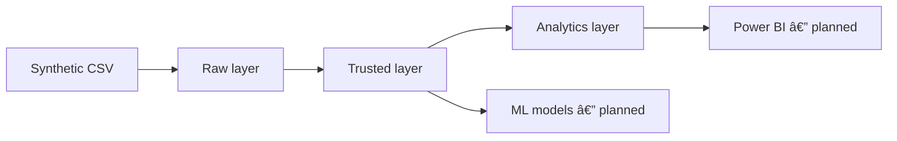

# Smart Credit Analytics

End-to-end data platform for credit-risk analytics in a personal-loan fintech.
The project combines data engineering, analytics, governance, and a dimensional
model designed to support credit decisions, portfolio monitoring, fraud
analysis, dashboards, and future machine-learning models.

> **Current stage:** the data foundation is implemented through the analytics
> and validation layers. Dashboards, exploratory notebooks, predictive models,
> and real-time scoring are planned for later phases and are not presented as
> completed deliverables.

## Business Problem

A lending fintech must approve as many eligible customers as possible while
keeping expected credit losses and fraud exposure within acceptable limits.
Reliable decision-making depends on consistent application data, traceable
transformations, controlled business rules, and analytical metrics that can be
reproduced and audited.

## Project Objective

Build a governed and reproducible data foundation that:

- ingests synthetic personal-loan application data;
- preserves source-level records in a raw layer;
- standardizes and validates data in a trusted layer;
- organizes analytical data in a star schema;
- supports credit, approval, default, and fraud KPIs;
- documents data quality, lineage, and execution procedures;
- prepares reliable inputs for Power BI and machine-learning phases.

## Current Scope

The current version includes:

- business requirements and solution architecture;
- a synthetic fintech credit-risk dataset;
- PostgreSQL schemas for governance, raw, trusted, and analytics layers;
- DDL, bootstrap, incremental-load, analytics, and validation SQL scripts;
- a dimensional model centered on credit applications;
- data-quality controls and reconciliation queries;
- data dictionary, lineage, and pipeline execution documentation.

The following items are intentionally reserved for future phases:

- exploratory data analysis in notebooks;
- Power BI dashboards;
- statistical and machine-learning models;
- model explainability and monitoring;
- orchestration and automated scheduling;
- real-time credit-decision API.

## Architecture



The pipeline follows a layered approach:

1. **Raw:** preserves source data with ingestion metadata.
2. **Trusted:** standardizes types, applies business rules, and rejects or
   identifies invalid records.
3. **Analytics:** exposes a dimensional model and business-ready metrics.
4. **Governance:** records control information required for traceability,
   execution, and data-quality monitoring.

Detailed diagrams are available in
[Solution Architecture](docs/assets/solution_architecture.png) and
[Star Schema ERD](docs/assets/erd_star_schema.png).

## Data Model

The analytical model uses a star-schema design with credit applications as the
main business process.

**Central fact**

- `fact_credit_applications`

**Main dimensions**

- `dim_customer`
- `dim_location`
- `dim_channel`
- `dim_credit_profile`
- `dim_digital_risk`
- `dim_date`

This design separates descriptive business context from measurable application
events and supports analysis by customer profile, geography, acquisition
channel, credit behavior, digital risk, and time.

## Technologies

### Implemented in the current phase

- PostgreSQL
- SQL
- CSV
- Git and GitHub
- Markdown

### Planned for later phases

- Python
- Jupyter Notebook
- scikit-learn and XGBoost
- Power BI
- API and pipeline orchestration tools

## Project Structure

```text
smart-credit-analytics/
├── dashboards/                    # Power BI files and exports — planned
├── data/
│   └── raw/
│       └── fintech_credit_risk_dataset.csv
├── docs/
│   ├── assets/
│   │   ├── solution_architecture.png
│   │   └── erd_star_schema.png
│   ├── 01_business_requirements.md
│   ├── 02_solution_architecture.md
│   ├── 03_data_dictionary.md
│   ├── 04_data_model.md
│   ├── 05_data_quality_rules.md
│   ├── 06_data_lineage.md
│   └── 07_pipeline_execution.md
├── models/                        # Model code/configuration — planned
├── notebooks/                     # EDA and experiments — planned
├── sql/
│   ├── 00_setup/
│   ├── 01_ddl/
│   ├── 02_bootstrap/
│   ├── 03_incremental/
│   ├── 04_analytics/
│   └── 05_validation/
├── src/                           # Reusable Python pipeline code — planned
├── .gitignore
└── README.md
```

Empty planned directories can contain a `.gitkeep` file so that Git preserves
the project structure before their implementation begins.

## SQL Organization

| Directory | Responsibility |
| --- | --- |
| `00_setup` | Database, schemas, extensions, and initial configuration |
| `01_ddl` | Tables, constraints, keys, and database objects |
| `02_bootstrap` | Initial governance and reference-data setup |
| `03_incremental` | Repeatable ingestion and transformation routines |
| `04_analytics` | Dimensional objects, analytical views, and business metrics |
| `05_validation` | Layer validation, reconciliation, and quality checks |

Files inside each directory must be executed in ascending numeric order.
Rebuild or destructive scripts must not be part of the standard incremental
run. The authoritative runbook is
[Pipeline Execution](docs/07_pipeline_execution.md).

## How to Run

### Prerequisites

- PostgreSQL installed and running;
- a SQL client such as `psql` or pgAdmin;
- access to the local project directory;
- permission to create the project database and schemas.

### Execution

1. Clone the repository:

   ```bash
   git clone https://github.com/rufinoivan012-a11y/smart-credit-analytics.git
   cd smart-credit-analytics
   ```

2. Review the source-file path and database settings described in
   `docs/07_pipeline_execution.md`.

3. Execute the SQL directories in this order:

   ```text
   sql/00_setup
            00_create_database
            01_create_schemas
            02_create_extensions
            03_create_governance
   sql/01_ddl
            04_create_raw_tables
            05_create_staging_functions
            06_create_staging_table
            07_crate_trusted_table
   sql/02_bootstrap
            08_start_initial_batch
            09_load_raw_initial
            10_load_staging_full_refresh
            12_load_dim_date
            13_load_dimensions_initial
            14_load_fact_initial
            16_complete_initial_batch
   sql/03_incremental
   sql/04_analytics
            17_crate_analytics_marts
   sql/05_validation
            11_validate_staging
            15_validate_trusted
            18_validate_analytics
   ```

4. Confirm that every validation query returns the expected result before
   considering the load successful.

The exact script-by-script order, prerequisites, expected outputs, and recovery
steps are documented in
[Pipeline Execution](docs/07_pipeline_execution.md).

## Data Quality and Governance

The validation strategy covers:

- mandatory-field completeness;
- uniqueness of business identifiers such as `application_id`;
- data-type and accepted-domain checks;
- valid ranges for financial, demographic, and risk attributes;
- referential integrity between facts and dimensions;
- duplicate detection;
- row-count and value reconciliation across layers;
- auditability of ingestion and transformation runs.

See:

- [Data Quality Rules](docs/05_data_quality.md)
- [Data Lineage](docs/06_data_lineage.md)
- [Data Dictionary](docs/03_data_dictionary.md)

## Reproducibility and Data Privacy

`data/raw/fintech_credit_risk_dataset.csv` is a synthetic dataset created for
educational and portfolio purposes. It must not contain real customer
information or production credentials.

The repository intentionally excludes secrets, local environment files,
database dumps, logs, generated datasets, caches, and heavy model artifacts.
If the source dataset is replaced with real, confidential, or regulated data,
it must be removed from version control immediately.

## Roadmap

- [x] Define business requirements
- [x] Design solution architecture and dimensional model
- [x] Build raw, trusted, analytics, and governance structures
- [x] Implement ingestion and transformation SQL
- [x] Validate trusted and analytics layers
- [x] Document quality rules, lineage, and pipeline execution
- [ ] Develop exploratory analysis notebooks
- [ ] Build the Power BI executive and risk dashboards
- [ ] Train baseline and challenger credit-risk models
- [ ] Add explainability, fairness, and model-monitoring controls
- [ ] Implement orchestration and automated tests
- [ ] Expose a controlled real-time scoring API

## Documentation

| Document | Purpose |
| --- | --- |
| [Business Requirements](docs/01_business_requirements.md) | Business problem, objectives, scope, and decision rules |
| [Solution Architecture](docs/02_solution_architecture.md) | Components, layers, and technical flow |
| [Data Dictionary](docs/03_data_dictionary.md) | Fields, types, definitions, and business meaning |
| [Data Model](docs/04_data_model.md) | Entities, relationships, keys, and dimensional design |
| [Data Quality](docs/05_data_quality_rules.md) | Quality dimensions, rules, thresholds, and controls |
| [Data Lineage](docs/06_data_lineage.md) | Source-to-target transformations and dependencies |
| [Pipeline Execution](docs/07_pipeline_execution.md) | Execution order, validation, recovery, and operations |

## Author

**Ivan Rufino**

- [LinkedIn](https://www.linkedin.com/in/ivan-rufino-data)
- [GitHub](https://github.com/rufinoivan012-a11y)