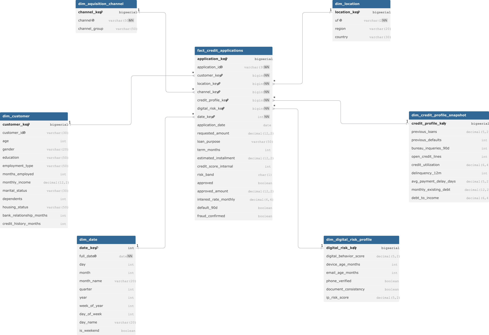

# Data Model

## 1. Purpose

This document describes the dimensional data model used in the Smart Credit Analytics Platform.

The model was designed to support credit risk analytics, fraud monitoring, business intelligence dashboards and machine learning feature engineering.

---

## 2. Model Overview

The project uses a dimensional model based on a Star Schema.

The central fact table is `fact_credit_applications`, which represents credit application events. Around the fact table, the model includes dimensions that describe customer attributes, location, acquisition channel, credit profile, digital risk profile and calendar dates.

This structure was designed to simplify analytical queries, improve BI performance and support the creation of machine learning datasets.

---

## 3. ERD - Star Schema



---

## 4. Fact Table Granularity

The grain of the fact table is:

> One row represents one credit application submitted by a customer.

This means that each record in `fact_credit_applications` corresponds to a single credit request, including the requested amount, decision attributes, risk indicators and final outcomes.

---

## 5. Tables

### 5.1 fact_credit_applications

Main fact table containing the credit application event.

It stores:

* application identifier;
* foreign keys to dimensions;
* credit request attributes;
* credit decision attributes;
* risk outcomes;
* fraud outcome.

Primary key:

* `application_key`

Business key:

* `application_id`

---

### 5.2 dim_customer

Dimension containing customer demographic and financial attributes.

Examples:

* age;
* gender;
* education;
* employment type;
* monthly income;
* housing status;
* credit history months.

---

### 5.3 dim_location

Dimension containing geographic information.

Examples:

* UF;
* region;
* country.

---

### 5.4 dim_acquisition_channel

Dimension containing the channel used by the customer to submit the credit application.

Examples:

* mobile app;
* web portal;
* partner;
* WhatsApp.

---

### 5.5 dim_credit_profile_snapshot

Dimension containing credit profile attributes captured at the moment of the application.

Examples:

* previous loans;
* previous defaults;
* bureau inquiries in the last 90 days;
* open credit lines;
* credit utilization;
* debt-to-income ratio.

This table is modeled as a snapshot because the customer credit profile may change over time.

---

### 5.6 dim_digital_risk_profile

Dimension containing digital and anti-fraud signals captured during the application process.

Examples:

* digital behavior score;
* device age;
* email age;
* phone verification;
* document consistency;
* IP risk score.

---

### 5.7 dim_date

Calendar dimension used to support time-based analysis.

Examples:

* full date;
* day;
* month;
* quarter;
* year;
* week of year;
* weekend flag.

---

## 6. Relationships

The model follows one-to-many relationships between dimensions and the fact table.

```text
dim_customer                    1:N fact_credit_applications
dim_location                    1:N fact_credit_applications
dim_acquisition_channel         1:N fact_credit_applications
dim_credit_profile_snapshot     1:N fact_credit_applications
dim_digital_risk_profile        1:N fact_credit_applications
dim_date                        1:N fact_credit_applications
```

Each fact record must be linked to valid dimension records through foreign keys.

---

## 7. Modeling Decisions

### 7.1 Use of Surrogate Keys

The model uses surrogate keys ending with `_key`.

Examples:

* `customer_key`;
* `location_key`;
* `channel_key`;
* `credit_profile_key`;
* `digital_risk_key`;
* `date_key`.

Surrogate keys were used to improve join performance, support historical tracking and separate Data Warehouse identifiers from source system identifiers.

---

### 7.2 Use of Business Keys

Business identifiers from the source system were preserved.

Examples:

* `application_id`;
* `customer_id`.

These fields are useful for traceability and audit.

---

### 7.3 Fact Table Design

Credit decision and outcome fields were included in `fact_credit_applications` because they are directly related to the credit application event.

Examples:

* `approved`;
* `approved_amount`;
* `interest_rate_monthly`;
* `default_90d`;
* `fraud_confirmed`.

This design simplifies analytics, BI reporting and machine learning datasets.

---

### 7.4 Snapshot Dimensions

Credit profile and digital risk profile were modeled as snapshot dimensions because they represent the customer situation at the moment of the application.

This avoids overwriting historical risk information when a customer profile changes over time.

---

## 8. BI and Analytics Usage

This model supports the following analyses:

* approval rate by channel;
* default rate by risk band;
* fraud rate by digital risk profile;
* credit volume by region;
* requested amount and approved amount over time;
* customer segmentation by income, employment type and credit history.

---

## 9. Machine Learning Usage

The model supports the creation of analytical datasets for:

* default prediction;
* fraud prediction;
* credit decision simulation;
* risk segmentation.

The recommended ML training dataset should be created from the analytical layer by joining the fact table with all relevant dimensions.

For default prediction, only approved applications should be used, because rejected applications do not generate real repayment behavior.

---

## 10. Notes

This model was designed for analytical workloads and not for transactional processing.

The goal is to support reporting, monitoring, feature engineering and decision intelligence.
