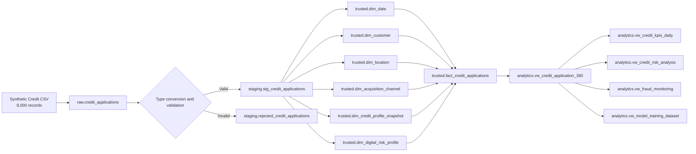
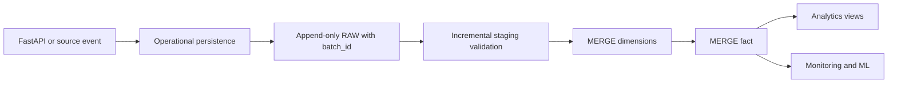

# Data Lineage

## 1. Purpose

This document describes the end-to-end data lineage of the **Smart Credit Analytics Platform**, including source, transformations, destinations, and dependencies between database objects.

The current lineage represents the validated historical bootstrap. Incremental processing and the near-real-time operational path will be added in later versions.

## 2. End-to-End Lineage



## 3. Source Dataset

| Property | Value |
|---|---|
| Source type | Synthetic CSV |
| Product | Unsecured personal loan |
| Records | 8,000 |
| Business columns | 42 |
| Business application key | `application_id` |
| Customer key | `customer_id` |
| Date range | 2024-01-01 to 2026-04-30 |
| Expected file name | `fintech_credit_risk_dataset.csv` |

Covered domains:

- application identification;
- customer profile;
- location;
- acquisition channel;
- credit profile;
- loan terms;
- digital and antifraud signals;
- internal score and risk band;
- approval decision;
- 90-day default outcome;
- confirmed fraud outcome.

## 4. RAW Layer

Object:

```text
raw.credit_applications
```

Responsibilities:

- receive the source without applying business rules;
- preserve source values;
- provide basic ingestion traceability.

The 42 business columns are stored as `TEXT`.

Additional metadata:

| Field | Lineage source |
|---|---|
| `source_file` | Source file name |
| `ingested_at` | Database ingestion timestamp |

The first historical load was completed before formal `batch_id` governance was introduced.

## 5. RAW to STAGING

Main script:

```text
10_load_staging_full_refresh.sql
```

Conversion functions:

```text
staging.try_integer
staging.try_numeric
staging.try_date
staging.try_boolean
```

Transformation patterns:

| RAW source | Transformation | STAGING destination |
|---|---|---|
| IDs | trim; empty string to `NULL` | `VARCHAR` |
| Date | safe conversion | `DATE` |
| UF | `UPPER(TRIM())` | two-character code |
| Categorical fields | `LOWER(TRIM())` | normalized `VARCHAR` |
| Counts | safe conversion | `INTEGER` |
| Monetary values | safe conversion | `DECIMAL` |
| Ratios and scores | safe conversion | `DECIMAL` |
| Binary flags | safe conversion | `BOOLEAN` |
| Full original row | `TO_JSONB(raw_row)` | rejected-row payload |

Valid destination:

```text
staging.stg_credit_applications
```

The table stores typed business fields and:

- `source_file`
- `raw_ingested_at`
- `staging_loaded_at`
- `validation_status`

Rejected destination:

```text
staging.rejected_credit_applications
```

The original payload is preserved in `raw_record JSONB`, together with one or more rejection reasons.

## 6. STAGING to TRUSTED

### 6.1 Date dimension

```text
staging.application_date
    ↓
trusted.dim_date
```

Key rule:

```text
date_key = YYYYMMDD
```

### 6.2 Customer dimension

```text
staging.customer_id + customer attributes
    ↓
trusted.dim_customer
```

The initial load retains the most recent record for each `customer_id`.

### 6.3 Location dimension

```text
staging.uf
    ↓
trusted.dim_location
```

Derived fields:

- Brazilian region;
- country = Brazil.

### 6.4 Acquisition channel dimension

```text
staging.channel
    ↓
trusted.dim_acquisition_channel
```

Derived field: `channel_group`.

### 6.5 Credit profile snapshot

```text
staging.previous_loans
staging.previous_defaults
staging.bureau_inquiries_90d
staging.open_credit_lines
staging.credit_utilization
staging.delinquency_12m
staging.avg_payment_delay_days
staging.monthly_existing_debt
staging.debt_to_income
    ↓
trusted.dim_credit_profile_snapshot
```

### 6.6 Digital risk profile

```text
staging.digital_behavior_score
staging.device_age_months
staging.email_age_months
staging.phone_verified
staging.document_consistency
staging.ip_risk_score
    ↓
trusted.dim_digital_risk_profile
```

### 6.7 Credit application fact

```text
trusted.fact_credit_applications
```

Grain:

```text
One row = one credit application
```

Dimension keys:

- `date_key`
- `customer_key`
- `location_key`
- `channel_key`
- `credit_profile_key`
- `digital_risk_key`

Measures and outcomes include:

- `requested_amount`
- `estimated_installment`
- `credit_score_internal`
- `approved_amount`
- `interest_rate_monthly`
- `approved`
- `default_90d`
- `fraud_confirmed`

## 7. TRUSTED to ANALYTICS

### 7.1 Credit application 360

```text
analytics.vw_credit_application_360
```

Sources: the fact and all related dimensions.

Grain: one row per application.

Derived fields include:

- `requested_amount_to_income`
- `installment_to_income`
- `decision_status`
- `approved_flag`
- `default_90d_flag`
- `fraud_confirmed_flag`

### 7.2 Daily KPIs

```text
analytics.vw_credit_kpis_daily
```

Source: `analytics.vw_credit_application_360`.

### 7.3 Risk analysis

```text
analytics.vw_credit_risk_analysis
```

Primary aggregation: `risk_band`.

### 7.4 Fraud monitoring

```text
analytics.vw_fraud_monitoring
```

Grain:

```text
application date + state + channel
```

### 7.5 Model training dataset

```text
analytics.vw_model_training_dataset
```

Targets:

- `default_90d`
- `fraud_confirmed`

Controls:

- model eligibility flags;
- removal of post-decision leakage features.

## 8. Reconciliation Results

| Source | Destination | Validated result |
|---|---|---:|
| RAW | Valid staging + rejected | 8,000 = 8,000 + 0 |
| Valid staging | Fact | 8,000 = 8,000 |
| Fact | 360 view | 8,000 = 8,000 |
| Fact application IDs | Distinct applications | 8,000 = 8,000 |
| Fact to dimensions | Orphan keys | 0 |
| Analytics aggregates | Financial differences | 0 |

## 9. Governance Context

Planned execution-control object:

```text
governance.etl_batch_control
```

The initial bootstrap was completed before formal batch control was implemented. Therefore:

- `08_start_initial_batch.sql` was not executed retroactively;
- `09_load_raw_initial.sql` is retained for clean rebuilds;
- `16_complete_initial_batch.sql` was not executed without an open batch;
- formal batch governance applies to future rebuilds and incremental loads.

## 10. Planned Incremental Lineage



Planned controls:

- `batch_id`;
- `record_hash`;
- incremental ingestion;
- `MERGE` or `UPSERT`;
- late-arriving outcomes;
- nullable outcomes at application time;
- asynchronous analytical ingestion after near-real-time decisioning.
